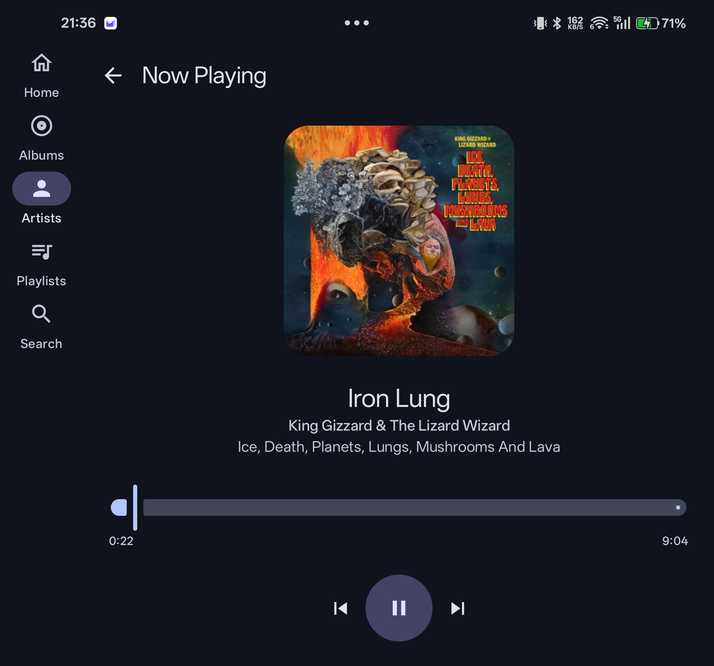
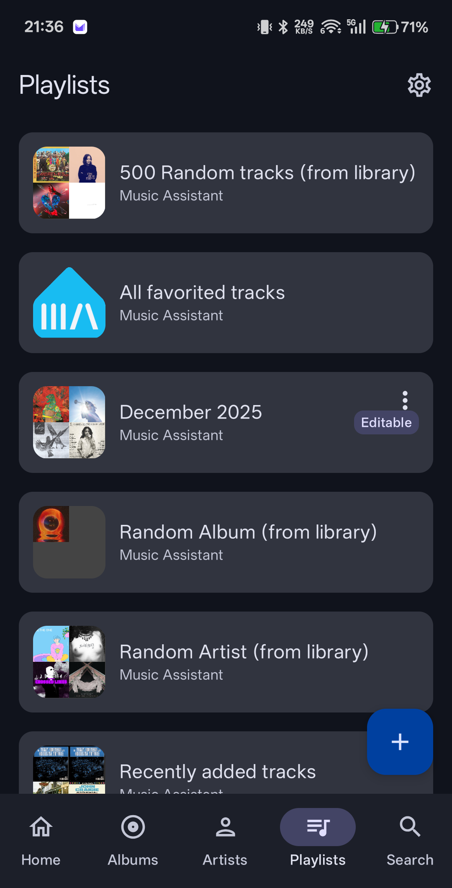
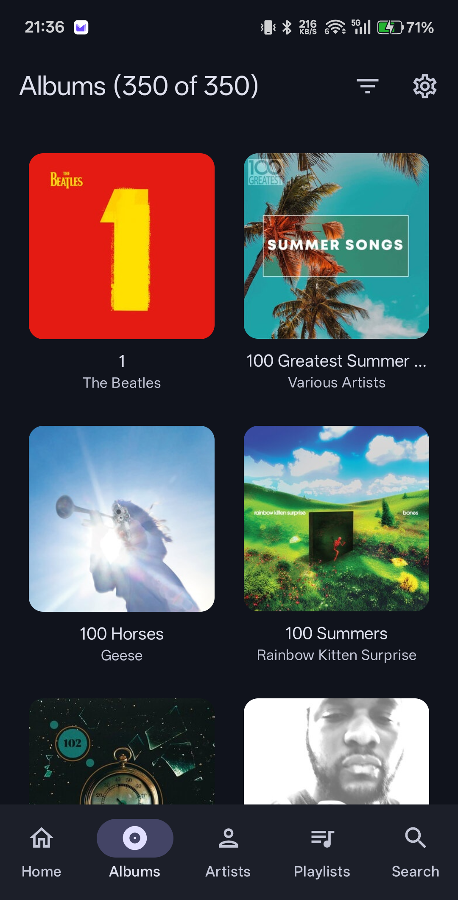
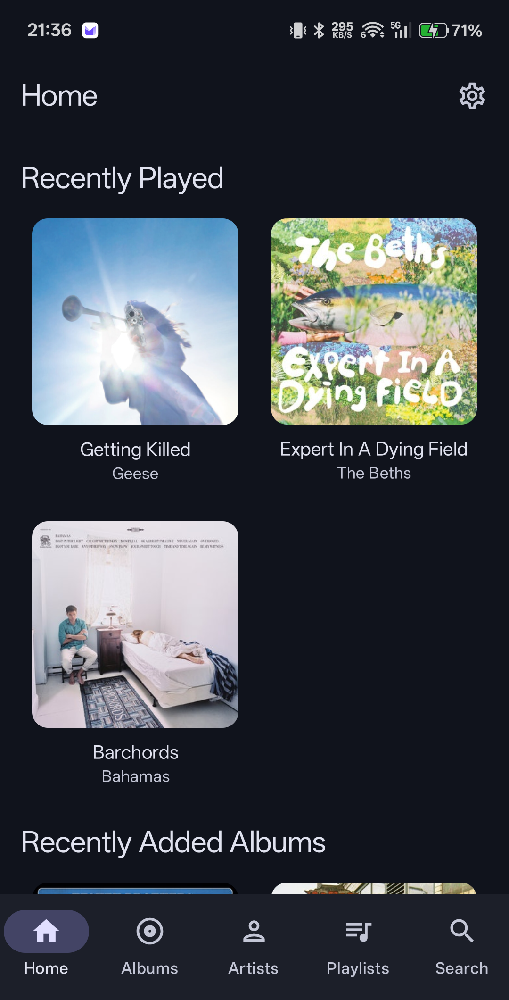

# Harmonixia (Android)

Harmonixia is a Jetpack Compose Android client for Music Assistant, focused on fast library browsing,
playback control, and EQ presets.  Primarily built with ChatGPT Codex.

## Screenshots

| | |
| --- | --- |
|  |  |
|  |  |

## Requirements

### Runtime
- Android 11 (API 30) or later (minSdk 30)
- Music Assistant 2.7 server reachable either on the local network or via the public internet (required)
- Optional: a long-lived Music Assistant access token for authenticated servers

### Development
- JDK 17
- Android SDK Platform 35 (compileSdk 35, targetSdk 35)
- Android Studio or Gradle (AGP 8.13.2, Kotlin 2.1.0)

## Run the app

1. Start Music Assistant 2.7 and ensure the device/emulator can reach it over the network.
2. Open this project in Android Studio or ensure `ANDROID_HOME` / `local.properties` points to your SDK.
3. Build and install:
   - Android Studio: Run the `app` configuration
   - CLI: `./gradlew installDebug`
4. On first launch, enter the Music Assistant server URL (http(s)://host:port) and, if needed, an access token.

## Implementation details

- Architecture: MVVM-style UI with a data/domain/UI split. Repositories expose flows of state and use cases
  coordinate library, playback, and EQ operations.
- Networking: OkHttp WebSocket client connects to Music Assistant at `/ws`, queues requests until connected,
  and retries with exponential backoff. JSON parsing uses `kotlinx.serialization`.
- Playback: Media3 `MediaSessionService` hosts an ExoPlayer instance and foreground notification.
  `PlaybackStateManager` polls the active queue every 2 seconds to keep local playback in sync, and the
  service holds a partial wake lock while playing.
- Sendspin streaming: `SendspinPlaybackManager` opens a dedicated WebSocket for PCM audio, performs time
  sync, and writes to `AudioTrack`, which is also used for EQ processing.
- Equalizer: Android `Equalizer` effect is attached to the active audio session and driven by presets.
  Presets are downloaded from the OPRA database and cached for 7 days.
- Images: Coil 3 with an auth-aware OkHttp interceptor, memory cache, and a 300 MB disk cache. Artwork uses
  Music Assistant's image proxy (`/imageproxy`) when provided by the server.
- Prefetch: WorkManager prefetches album tracks and artist data when the device is idle, connected, and not
  low on battery to reduce perceived load times.
- UI: Compose Material 3 with adaptive navigation (bottom bar vs. rail), shared artwork transitions, and a
  mini-player overlay.

## Attribution

- OPRA Project (https://github.com/opra-project/OPRA): EQ preset database (`database_v1.jsonl`) used for
  downloadable equalizer presets. Please review the OPRA project license for usage terms.
- Alphabet fast scroller based on the Compose scrolling bubble example:
  https://github.com/ekeitho/compose-scrolling-bubble
